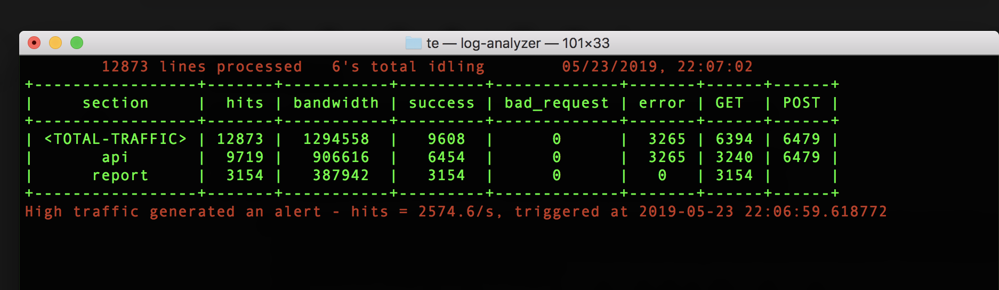
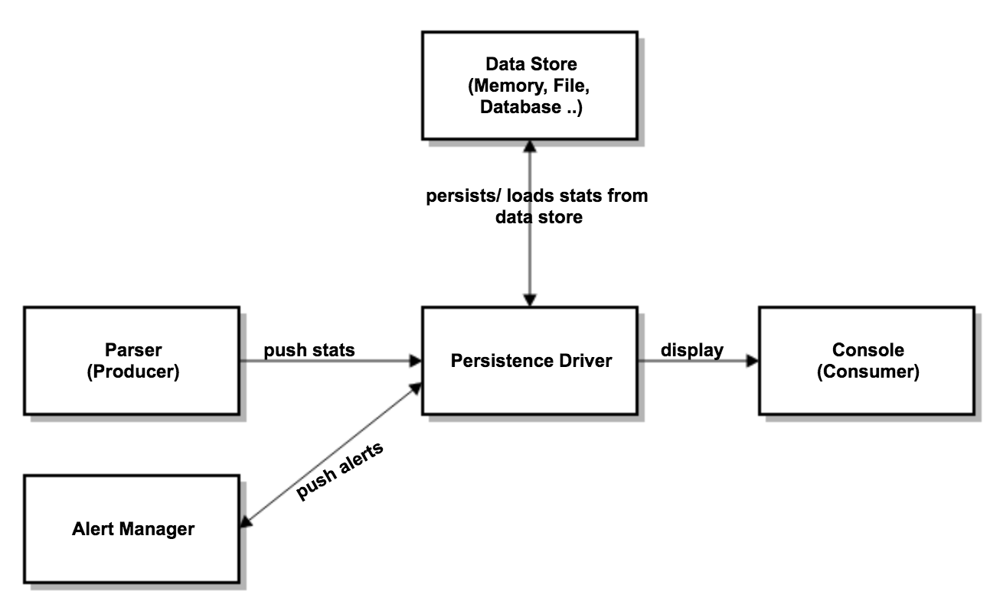

[](https://badge.fury.io/py/log-analyzer)
[](https://pypi.org/project/log-analyzer/)
[](https://travis-ci.com/yurilaaziz/log-analyzer/)
[](https://codecov.io/gh/yurilaaziz/log-analyzer)

# Description
Log-analyzer is a human and straightforward log analyzer for rapid troubleshooting.

*Note*:

This project starts to be an interview project. Now I am using it to monitor my website traffic.

# Get started 

## Install from github 
```
pip install git+http://github.com/yurilaaziz/log-analyzer.git

```

## Install from PyPi 
```
pip install log-analyzer

```

## Run log analyzer
````commandline
log-analyzer 
````
By default, the log-analyzer reads the log from /var/log/access.log




## Run log analyzer with external configuration
````commandline
LOGANALYZER_CONFIG_FILE=sample.config.yml log-analyzer 
````

## Run log analyzer with another log file
````commandline
LOGANALYZER_PARSER_INPUT=/tmp/test.log log-analyzer 
````

## Design 



Log Analyzer containers on three components : 
* Parser Process : 
   * Reads the log file 
   * Process lines following a pattern class
   * Push data to the Persistence driver
* Consumer Process (Console Display):
   * Reads data from the persistence driver
   * Display an array ordered by hits 
* Alert Manager:
   * Compute rules defined in the pattern alert's class
   * Push notification to persistence driver to be displayed on the console   
   
* Persistence Driver:
   * Define interfaces between producer and consumer.
   * Allow persisting data to different data-store 

## Configuration 

Log Analyzer uses Config42 to manage its configuration. that means every variable present in the configuration file could be overloaded from 
Environment variables, Configuration file, external data store (ETCD)

Here an example of default configuration in YAML format:
[configuration file](sample.config.yml)


## TO DO 
- [x] Rework the Alert Manager process to Delete Alert Class and read Alerting rules from the configuration 
- [ ] Rework the __main__ for a better CLI with 'docopt' 
- [ ] Write a persistence driver to support ElasticSearch/InfluxDB data-store
- [ ] Support multiple log files/sources
- [ ] Support multiple Persistence drivers


